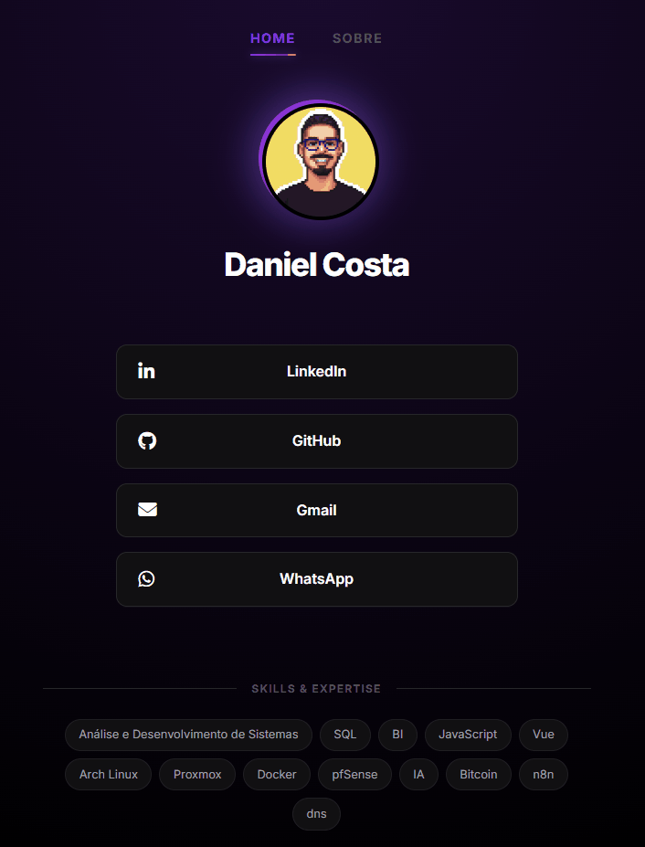

<div align="center">

# 🌐 danielcosta.dev.br

**Site pessoal e portfólio — desenvolvido com Vue 3 + Vite e hospedado no meu próprio homelab.**

[](https://vuejs.org/)
[](https://vitejs.dev/)
[](https://docker.com/)
[](https://nginx.org/)
[](https://www.cloudflare.com/products/tunnel/)

🔗 **[danielcosta.dev.br](https://danielcosta.dev.br)**

</div>

---

## 📸 Preview
<div align="center">
  
</div>

> *Acesse [danielcosta.dev.br](https://danielcosta.dev.br) para ver o site ao vivo.*

---

## ✨ Sobre o Projeto

Este é meu site pessoal e portfólio, onde apresento meus projetos, habilidades e formas de contato. O diferencial deste projeto está na **infraestrutura**: o site roda inteiramente no meu **homelab doméstico**, sem a necessidade de abrir portas no roteador ou contratar um servidor na nuvem — tudo exposto com segurança via **Cloudflare Tunnel**.

---

## 🛠️ Tecnologias

| Camada | Tecnologia |
|---|---|
| Frontend | Vue 3 + Vite + CSS |
| Servidor Web | Nginx (servindo arquivos estáticos do build) |
| Containerização | Docker + Docker Compose |
| Gerenciamento | Portainer |
| Tunelamento | Cloudflare Tunnel |
| Infraestrutura | Proxmox + Umbrel (homelab) |

---

## 🏗️ Infraestrutura

O site é hospedado em um servidor doméstico (**homelab**) rodando **Proxmox** como hipervisor, com **Umbrel** como base do sistema. Toda a stack de deploy é orquestrada via **Docker Compose** com três containers principais:

```
┌─────────────────────────────────────────────────────┐
│                    HOMELAB                          │
│                                                     │
│  ┌──────────┐    ┌──────────┐    ┌──────────────┐  │
│  │ meu-site │ -> │ servidor │ <- │  cloudflared │  │
│  │  (Node)  │    │  (Nginx) │    │   (Tunnel)   │  │
│  └──────────┘    └──────────┘    └──────┬───────┘  │
│                                         │           │
└─────────────────────────────────────────┼───────────┘
                                          │
                              ┌───────────▼───────────┐
                              │   Cloudflare Network   │
                              └───────────┬────────────┘
                                          │
                              ┌───────────▼────────────┐
                              │   danielcosta.dev.br   │
                              └────────────────────────┘
```

**Como funciona cada container:**

- **`meu-site`** — Container Node (Alpine) que clona o repositório, instala as dependências e executa o build (`npm run build`), exportando os arquivos para um volume compartilhado.
- **`servidor`** — Container Nginx que serve os arquivos estáticos gerados pelo build via volume compartilhado, com `read-only` para segurança.
- **`cloudflared`** — Container oficial da Cloudflare que cria um túnel seguro entre o servidor doméstico e a internet, sem necessidade de IP público ou abertura de portas.

```yaml
services:
  meu-site:
    image: node:alpine
    command: >
      sh -c "apk add git &&
      git clone https://github.com/DanielCosta12/danielcosta.git /app &&
      cd /app && npm install && npm run build &&
      cp -r /app/dist/* /output"
    volumes:
      - site-dist:/output

  servidor:
    image: nginx:alpine
    volumes:
      - site-dist:/usr/share/nginx/html:ro
    restart: always

  cloudflared:
    image: cloudflare/cloudflared:latest
    command: tunnel --no-autoupdate run --token SEU_TOKEN_AQUI
    restart: always

volumes:
  site-dist:
```

---

## 🚀 Rodando Localmente

```bash
# 1. Clone o repositório
git clone https://github.com/DanielCosta12/danielcosta.git
cd danielcosta

# 2. Instale as dependências
npm install

# 3. Inicie o servidor de desenvolvimento
npm run dev

# 4. Para gerar o build de produção
npm run build
```

---

## 📦 Deploy

O deploy é feito **manualmente via Portainer**: basta reiniciar o container `meu-site`, que automaticamente clona o repositório atualizado e regera o build de produção. O container `servidor` (Nginx) passa a servir os novos arquivos logo em seguida.

> **Nenhuma porta do roteador é aberta.** Todo o tráfego externo passa pelo Cloudflare Tunnel de forma segura e criptografada.

---

## 📬 Contato

<div align="center">

[](https://danielcosta.dev.br)
[](https://github.com/DanielCosta12)
[](https://www.linkedin.com/in/daniel-costa12)

</div>
