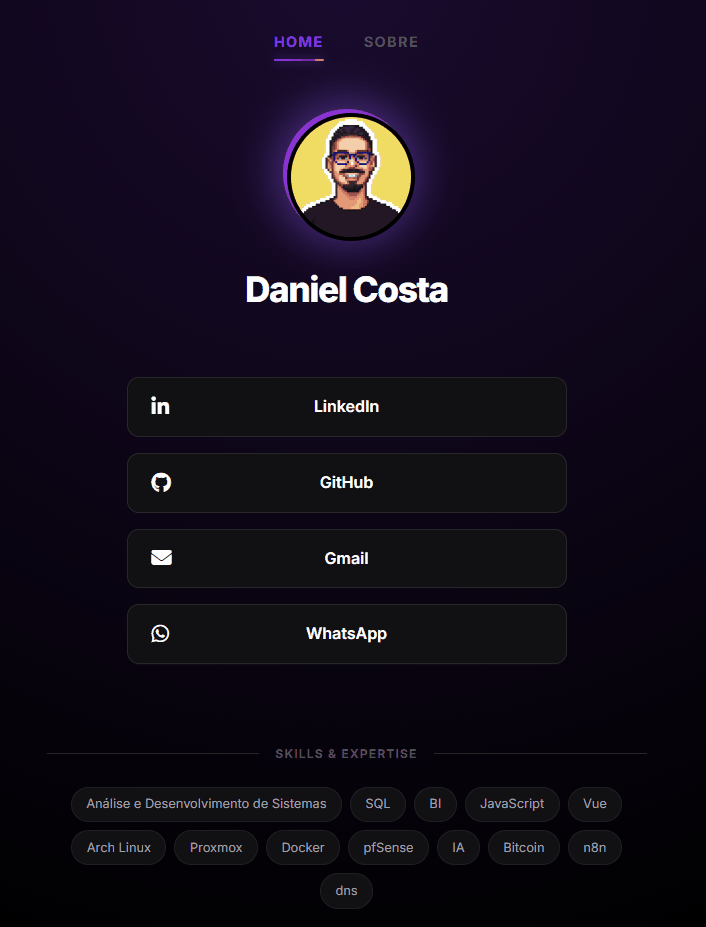

<div align="center">

# 🌐 danielcosta.dev.br

**Site pessoal e portfólio — desenvolvido com Vue 3 + Vite e hospedado no meu próprio homelab.**

[](https://vuejs.org/)
[](https://vitejs.dev/)
[](https://docker.com/)
[](https://nginx.org/)
[](https://www.cloudflare.com/products/tunnel/)

🔗 **[danielcosta.dev.br](https://danielcosta.dev.br)**

</div>

---

## 📸 Preview
<div align="center">
  
</div>

> *Acesse [danielcosta.dev.br](https://danielcosta.dev.br) para ver o site ao vivo.*

---

## ✨ Sobre o Projeto

Este é meu site pessoal e portfólio, onde apresento meus projetos, habilidades e formas de contato. O diferencial deste projeto está na **infraestrutura**: o site roda inteiramente no meu **homelab doméstico**, sem a necessidade de abrir portas no roteador ou contratar um servidor na nuvem — tudo exposto com segurança via **Cloudflare Tunnel**.

---

## 🛠️ Tecnologias

| Camada | Tecnologia |
|---|---|
| Frontend | Vue 3 + Vite + CSS |
| Servidor Web | Nginx (servindo arquivos estáticos do build) |
| Containerização | Docker + Docker Compose |
| Gerenciamento | Portainer GitOps |
| Tunelamento | Cloudflare Tunnel |
| Infraestrutura | Proxmox (homelab) |

---

## 🏗️ Infraestrutura

O site é hospedado em um servidor doméstico (**homelab**) rodando **Proxmox** como hipervisor. O deploy é orquestrado via **Portainer GitOps** com dois containers principais, construídos a partir de um **multi-stage Dockerfile**:

```
┌─────────────────────────────────────────────────────┐
│                    HOMELAB                          │
│                                                     │
│  ┌───────────────────────┐    ┌──────────────────┐  │
│  │  danielcosta-site     │    │   cloudflared    │  │
│  │  (Nginx + Vue build)  │    │    (Tunnel)      │  │
│  └───────────────────────┘    └────────┬─────────┘  │
│                                        │             │
└────────────────────────────────────────┼─────────────┘
                                         │
                             ┌───────────▼───────────┐
                             │   Cloudflare Network   │
                             └───────────┬────────────┘
                                         │
                             ┌───────────▼────────────┐
                             │   danielcosta.dev.br   │
                             └────────────────────────┘
```

**Como funciona cada container:**

- **`danielcosta-site`** — Build multi-stage: Stage 1 usa Node 20 Alpine para instalar dependências e gerar o build do Vue. Stage 2 usa Nginx Alpine para servir os arquivos estáticos do `dist/`.
- **`cloudflared`** — Container oficial da Cloudflare que cria um túnel seguro entre o servidor doméstico e a internet, sem necessidade de IP público ou abertura de portas.

```yaml
services:
  site:
    build:
      context: .
      dockerfile: Dockerfile
    image: danielcosta-vue
    container_name: danielcosta-site
    restart: always
    networks:
      - app

  cloudflared:
    image: cloudflare/cloudflared:latest
    container_name: cloudflared
    command: tunnel --no-autoupdate run
    environment:
      - TUNNEL_TOKEN=${KEY}
    restart: always
    networks:
      - app

networks:
  app:
    driver: bridge
```

---

## 🚀 Rodando Localmente

```bash
# 1. Clone o repositório
git clone https://github.com/DanielCosta12/danielcosta.dev.br.git
cd danielcosta.dev.br

# 2. Instale as dependências
npm install

# 3. Inicie o servidor de desenvolvimento
npm run dev

# 4. Para gerar o build de produção
npm run build
```

---

## 📦 Deploy

O deploy é gerenciado pelo **Portainer GitOps**:

1. Portainer clona este repositório automaticamente
2. Faz o build multi-stage usando o `Dockerfile`
3. Sobe os containers `danielcosta-site` e `cloudflared`
4. O Cloudflare Tunnel expõe o site em `danielcosta.dev.br`

> **Nenhuma porta do roteador é aberta.** Todo o tráfego externo passa pelo Cloudflare Tunnel de forma segura e criptografada.

---

## 📬 Contato

<div align="center">

[](https://danielcosta.dev.br)
[](https://github.com/DanielCosta12)
[](https://www.linkedin.com/in/daniel-costa12)

</div>